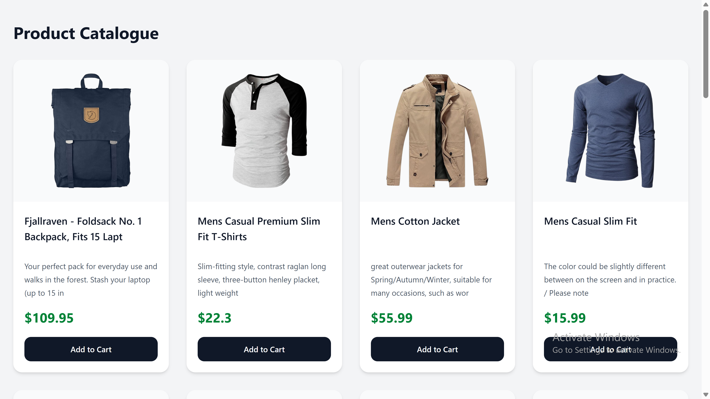

# Build a product catalogue page with the Fake Store API

APIs help developers retrieve and render product information dynamically, eliminating the need to hardcode product data during software development.

The Fake Store API is no different, as it enables developers to build functional e-commerce stores without needing to implement complex backend logic.

In this tutorial, you will learn how to make successful API calls to the Fake Store API, render product data dynamically, and build a responsive product catalogue page.

## Prerequisites

To follow through with this tutorial, you need:

- Basic knowledge of JavaScript

- Node.js version 14.0 and above

- Basic knowledge of HTTP methods

## Project setup

To build a responsive product catalogue page, you will need to clone a sample project.

To do this, run:

```bash
git clone https://github.com/Slimdan20/Product-catalogue
cd Product-catalogue
npm install
```


**Note:** *The above project is a product catalogue page and serves as the demo project for fetching and displaying the Fake Store API data.*

## The Fetch logic

With your project now set up, it is time to integrate the Fake Store API into it.

To get started, navigate to the `Product.jsx` file and import the necessary `hooks`:

```javascript
import React, { useEffect, useState } from "react";
```

Still in your `Products.jsx` file, create a state variable. 

```javascript
const [products, setProducts] = useState([]);
```

This will serve to store the product data returned by the API.

Finally, make a request to the API. run:

```javascript
useEffect(() => {
  const fetchProducts = async () => {
    try {
      const response = await fetch("https://fakestoreapi.com/products");

      if (!response.ok) {
        throw new Error("Failed to fetch products");
      }

      const data = await response.json();
      setProducts(data);
    } catch (error) {
      console.error(error);
    } 
  };

  fetchProducts();
}, []);
```

In the code above:

- `await fetch("https://fakestoreapi.com/products")` sends a request to the Fake Store API to retrieve a list of products.

- `await response.json()` converts the received API response into a JavaScript object that can be used in the application.

- `setProducts(data);` Updates and renders product data received from the Fake Store API in the product catalogue page. 


## Building the UI

So far, you have made a successful request to the Fake Store API, and received an array of products. You can take a step further by displaying these products on your product catalogue page.

To do this, navigate to your `Products.jsx` file and update as follows:

```javascript
{products.map((product) => (
  <ProductCard
    key={product.id}
    image={product.image}
    title={product.title}
    description={product.description}
    price={product.price}
  />
))}
```

In the code above:

- `products.map()` iterates through the array of product objects returned by the API.

- The `key` prop helps React efficiently update and render elements in the list.



## Conclusion

In this tutorial, you learned how to build a responsive product catalogue page.

You also explored how to make API requests to the Fake Store API and display the returned product data on your catalogue page.

You can review the complete tutorial code on [GitHub](https://github.com/Slimdan20/Product-catalogue).

