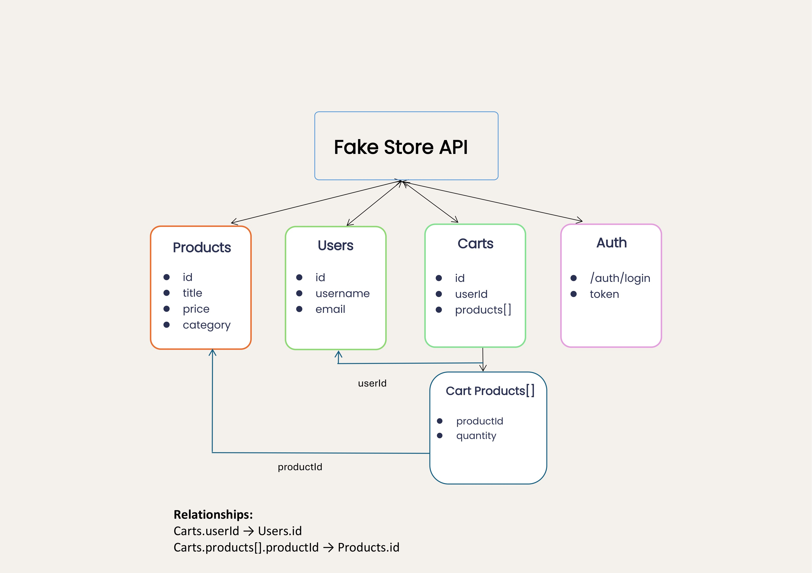

# Overview

The Fake Store API is a RESTful public API that allows you to build and test prototypes of e-commerce applications. It provides you access to e-commerce data such as products, carts, and users. The API simulates server-side behaviour, leaving you to focus on UI development and application logic.

The Fake Store API does not require a unique key or authentication method for basic data retrieval. Instead, it uses standard HTTP methods and returns JSON-formatted responses.

## Base URL

You can interact with the Fake Store API using the base URL:

```http
https://fakestoreapi.com
```

## API Resource Model



The Fake Store API is organized around a set of resource models that follow RESTful conventions and represent common e-commerce entities:

### Products (`/products`)

Represents an item available for purchase in the store.

- `id`: integer
- `title`: string
- `price`: number
- `description`: string
- `category`: string
- `image`: string
- `rating`: object (
    `rate`: number, 
    `count`: integer)

### Carts (`/carts`)

Represents a shopping cart associated with a user and contains products selected for purchase.

- `id`: integer
- `userId`: integer
- `date`: string
- `products`: array (`productId`: integer, `quantity`: integer)

### Users (`/users`)

Represents registered end-users of the e-commerce store.

- `id`: integer
- `email`: string
- `username`: string
- `password`: string
- `name`: object (`firstname`: string, `lastname`: string)
- `address`: object
- `phone`: string

## What's next?

- Make your first API call &rarr; [Quickstart guide](quickstart.md).

- Understand API responses &rarr; [Concepts guide](../Concept.md)

- Integrate the API into a product catalogue page &rarr; [Guide](../Guide/Guide-1).

